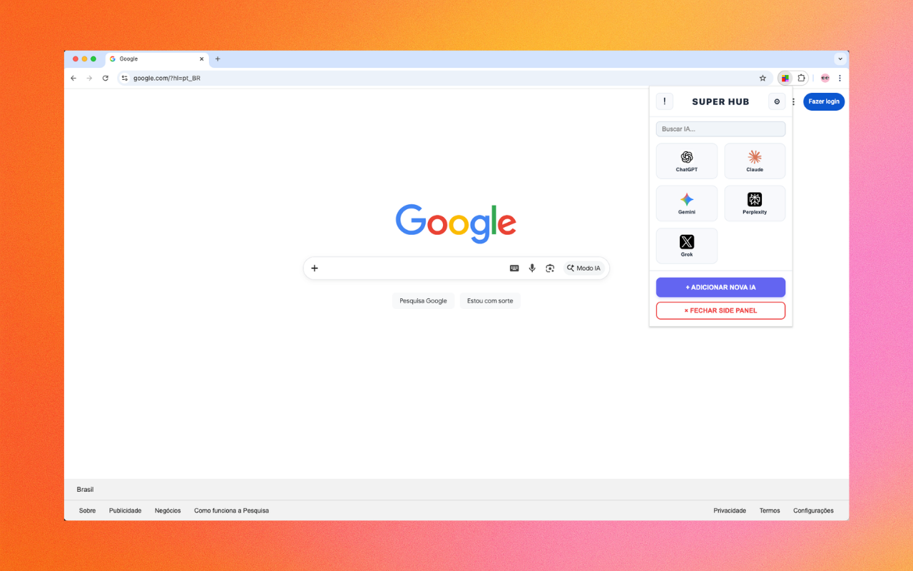
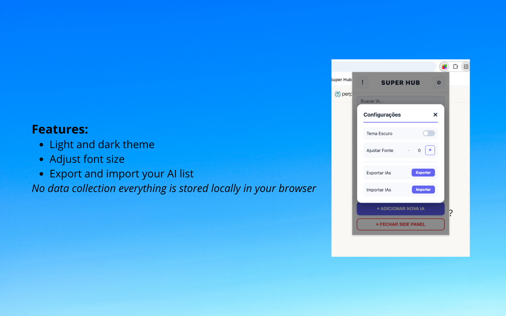
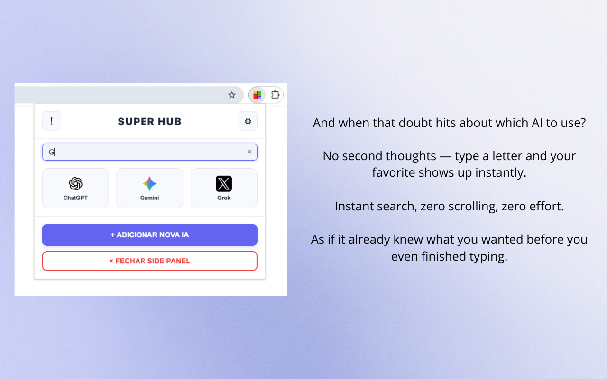

# ⚡ Super Hub

**[🇧🇷 Português](#-sobre-a-extensão) · [🇺🇸 English](#-about-the-extension)**

---

## 🇧🇷 Sobre a Extensão

> Acesse ChatGPT, Claude, Gemini e outras IAs em um painel lateral sem sair da sua página atual.

O **Super Hub** abre um painel lateral no Chrome com atalhos rápidos para suas IAs favoritas — sem abrir novas abas e sem perder o contexto da página que você está navegando.

Chega de perder o raciocínio toda vez que precisa consultar uma IA. Com o Super Hub, tudo fica visível ao mesmo tempo.

### ✅ Funcionalidades

- 📌 **Painel lateral fixo** — navegue e consulte IAs ao mesmo tempo
- 🤖 **IAs pré-configuradas** — ChatGPT, Claude, Gemini, Perplexity e Grok
- ✏️ **Totalmente personalizável** — adicione, edite e remova IAs com URL personalizada
- ↕️ **Drag-and-drop** — reordene os cards como quiser
- 🔍 **Busca em tempo real** — encontre rapidamente qualquer IA cadastrada
- 🌗 **Tema claro e escuro** — interface adaptável à sua preferência
- 🔡 **Ajuste de fonte** — controle o tamanho do texto
- 💾 **Exportar / Importar** — faça backup da sua lista de IAs
- 🔒 **Sem coleta de dados** — tudo fica armazenado localmente no seu navegador

### 📥 Instalar

Disponível gratuitamente na **Chrome Web Store**:

### 🖼️ Screenshots

| Painel lateral | Configurações | Busca em tempo real |
|:-:|:-:|:-:|
|  |  |  |

### 🔒 Privacidade

O Super Hub **não coleta, transmite ou armazena** nenhum dado pessoal. Todas as configurações ficam armazenadas localmente no seu navegador via `chrome.storage.local`.

Leia a política de privacidade completa em: [super-hub-sys.github.io/privacy.html](https://super-hub-sys.github.io/privacy.html)

---

## 🇺🇸 About the Extension

> Access ChatGPT, Claude, Gemini and other AIs in a side panel without leaving your current page.

**Super Hub** opens a side panel in Chrome with quick shortcuts to your favorite AIs — without opening new tabs and without losing the context of the page you're browsing.

No more losing your train of thought every time you need to consult an AI. With Super Hub, everything stays visible at the same time.

### ✅ Features

- 📌 **Fixed side panel** — browse and consult AIs at the same time
- 🤖 **Pre-configured AIs** — ChatGPT, Claude, Gemini, Perplexity and Grok
- ✏️ **Fully customizable** — add, edit and remove AIs with custom URLs
- ↕️ **Drag-and-drop** — reorder cards however you like
- 🔍 **Real-time search** — quickly find any registered AI
- 🌗 **Light & dark theme** — interface adapts to your preference
- 🔡 **Font size control** — adjust text size to your liking
- 💾 **Export / Import** — backup your AI list
- 🔒 **No data collection** — everything is stored locally in your browser

### 📥 Install

Available for free on the **Chrome Web Store**:

### 🖼️ Screenshots

| Side Panel | Settings | Real-time Search |
|:-:|:-:|:-:|
|  |  |  |

### 🔒 Privacy

Super Hub **does not collect, transmit or store** any personal data. All settings are stored locally in your browser via `chrome.storage.local`.

Read the full privacy policy at: [super-hub-sys.github.io/privacy.html](https://super-hub-sys.github.io/privacy.html)

---

## 🛠️ Technologies

---

## 📄 License / Licença

This project is licensed under the [MIT License](LICENSE).

Este projeto está licenciado sob a [Licença MIT](LICENSE).

---

  Feito com ⚡ por <a href="https://github.com/Super-Hub-SyS">SuperHub-SyS</a> 
  Made with ⚡ by <a href="https://github.com/Super-Hub-SyS">SuperHub-SyS</a>

